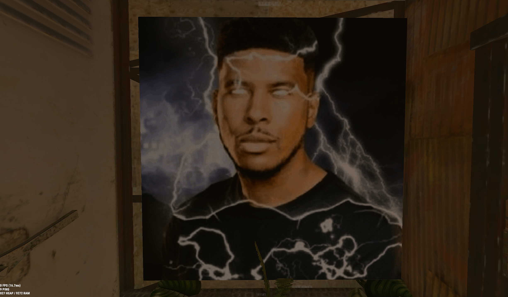
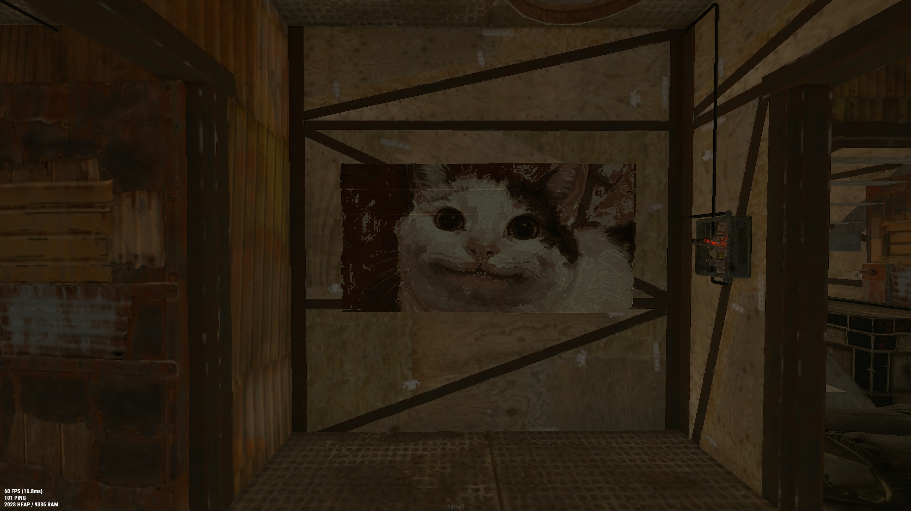
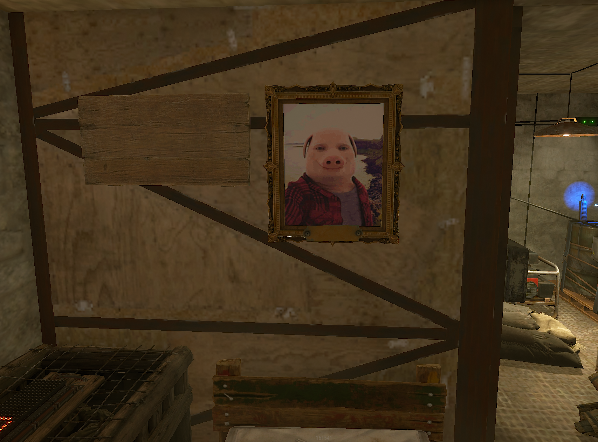
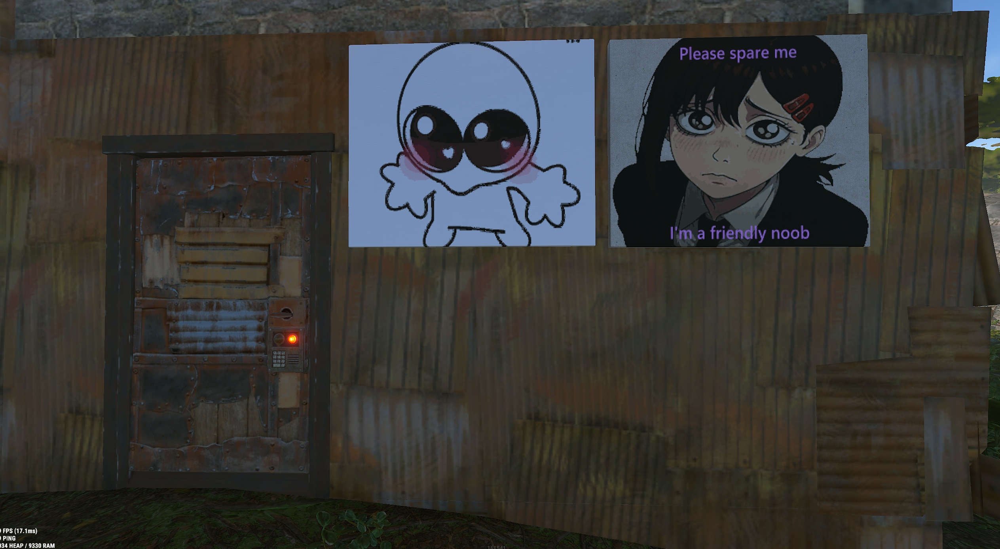
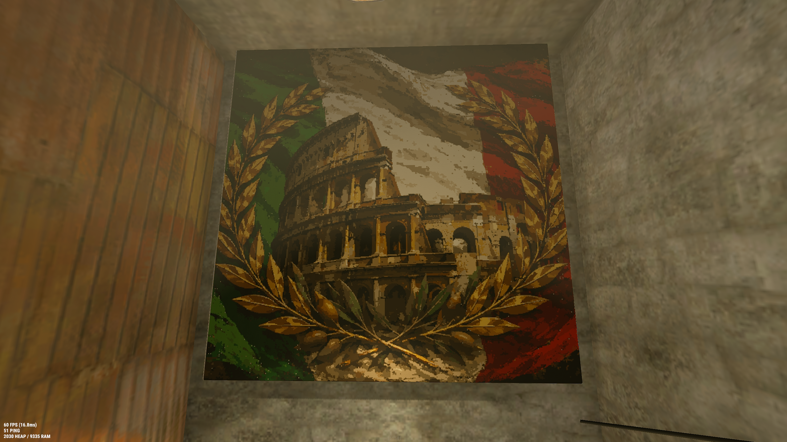
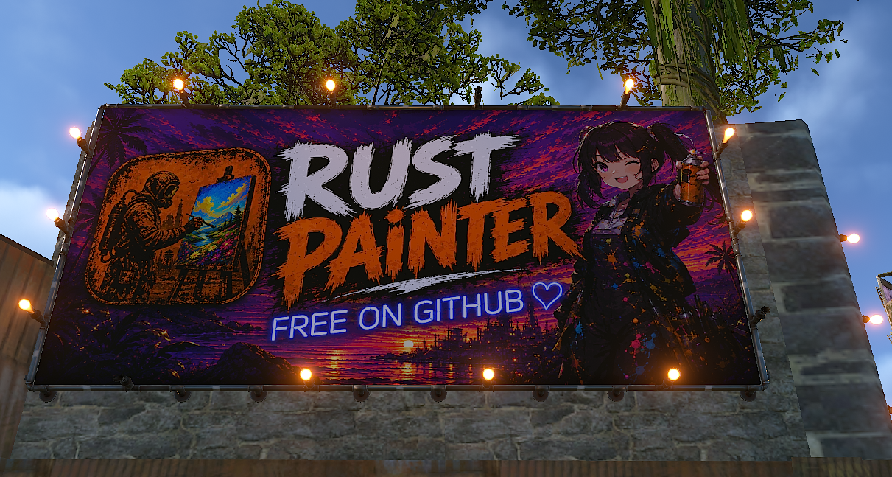
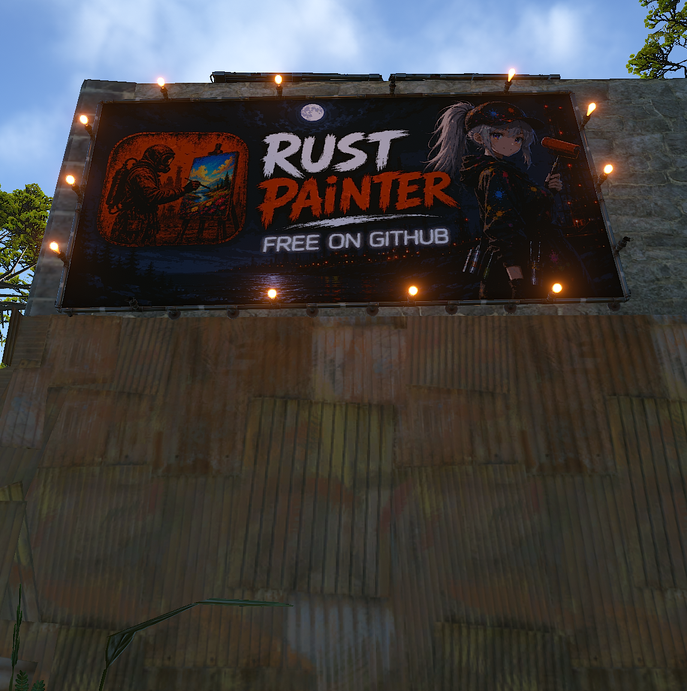
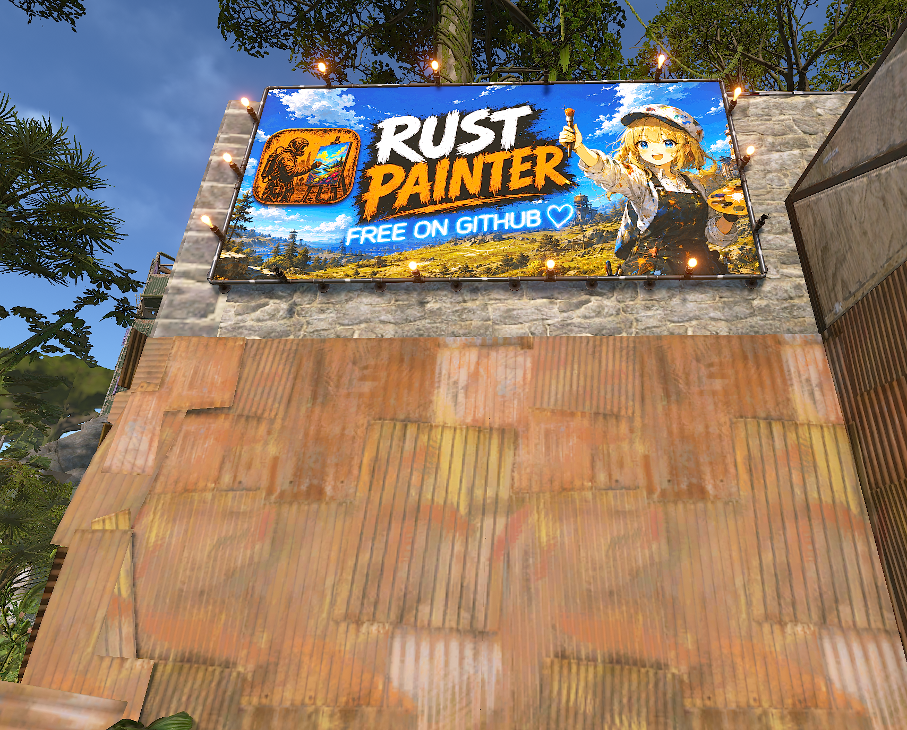

# RustPainter - Rust Sign Painter

<p align="center">
  
  &nbsp;&nbsp;
  <a href="https://discord.gg/VMNQtgD3v"></a>
</p>

RustPainter is a Windows app that takes an image and paints it onto a sign in Rust for you. It uses normal mouse input, so you set up the parts of Rust's paint UI it needs to click first.

basically, it handles the clicking and color picking part so you can turn an image into Rust sign art without manually painting every part of it.

## Made with RustPainter

<p align="center">
  <a href="PaintExamples/Ex1.png"></a>
  <a href="PaintExamples/Ex2.png"></a>
  <a href="PaintExamples/Ex3.png"></a><br>
  <a href="PaintExamples/Ex4.png"></a>
  <a href="PaintExamples/Ex5.png"></a>
  <a href="https://raw.githubusercontent.com/MapleTheParrot/RustPainter/main/PaintExamples/Ex6.png"></a><br>
  <a href="PaintExamples/Ex7.png"></a>
  <a href="PaintExamples/Ex8.png"></a>
  <a href="PaintExamples/Ex9.png"></a>
  <br>
  <a href="PaintExamples/Ex10.png"></a>
</p>

## Early build

this is the first public version of a tool I made for myself, and it works well for how I use it. The setup might still be confusing on a new PC or a different Rust UI layout though, so start with a small test image first.

if you try it, [join the Discord](https://discord.gg/VMNQtgD3v) and let me know what was confusing or what went wrong. That is basically what this release is for.

## Public test build

want to try it? [download the latest Windows test build](https://github.com/MapleTheParrot/RustPainter/releases/latest), then run `RustPainter.exe`. you dont need Python or anything else installed.

this is still early, so start with a small image first. if something is confusing or it paints wrong, [join the Discord](https://discord.gg/VMNQtgD3v) and let me know what happened.

you will need Windows 10 or 11 and Rust running in borderless or windowed mode.

## Use it

1. In RustPainter, calibrate the **canvas**, **color box**, and **hue bar** by dragging just inside each matching area in Rust's paint UI.
2. Drag an image into RustPainter, or click **Choose image**.
3. Check the preview and start with a small, low-color image so you can make sure your calibration is right.
4. Focus Rust during the countdown, then start painting.

`Ctrl+Alt+S` starts, pauses, or resumes a paint job. `Ctrl+Alt+X` stops it immediately and releases the mouse button. You can record any other available keyboard shortcut in Safety settings by pressing the shortcut and then Enter.

keep a hand near your stop shortcut on your first few runs and dont leave it painting unattended.

## Need help?

[ Join the Discord](https://discord.gg/VMNQtgD3v)

## Run from source

If you want to run the project yourself, install 64-bit Python 3.11 through 3.14, then run:

```powershell
git clone https://github.com/MapleTheParrot/RustPainter.git
cd RustPainter
py -m venv .venv
.\.venv\Scripts\Activate.ps1
python -m pip install -r requirements.txt
python main.py
```
