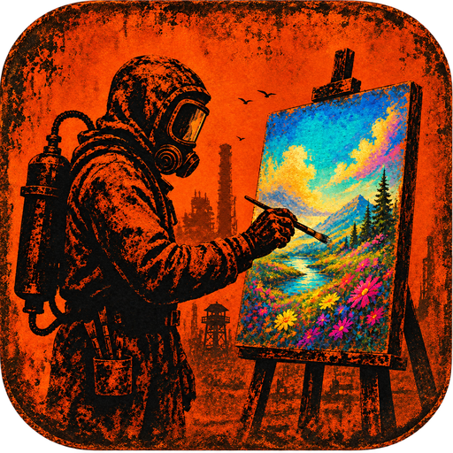

# RustPainter

<p align="center">
  
  &nbsp;&nbsp;
  <a href="https://discord.gg/VMNQtgD3v"></a>
</p>

this takes an image and paints it onto a Rust sign for you. It uses normal mouse input, so you set up the parts of Rust's paint UI it needs to click first.

## Early build

this is the first public version of a tool I made for myself, and it works well for how I use it. The setup might still be confusing on a new PC or a different Rust UI layout though, so start with a small test image first.

if you try it, [join the Discord](https://discord.gg/VMNQtgD3v) and let me know what was confusing or what went wrong. That is basically what this release is for.

## Public test build

I use this myself, but I am not posting a public `.exe` yet because the first-time setup still needs some work.

If you would actually want to try it, [join the Discord](https://discord.gg/VMNQtgD3v). I mainly want to see whether anyone else would use this before I spend more time making the setup easier.

When a test build is available, you will need Windows 10 or 11 and Rust running in borderless or windowed mode.

## Use it

1. In RustPainter, calibrate the **canvas**, **color box**, and **hue bar** by dragging just inside each matching area in Rust's paint UI.
2. Drag an image into RustPainter, or click **Choose image**.
3. Check the preview and start with a small, low-color image so you can make sure your calibration is right.
4. Focus Rust during the countdown, then start painting.

`F8` starts, pauses, or resumes a paint job. `F10` stops it immediately and releases the mouse button.

keep a hand near F10 on your first few runs and dont leave it painting unattended.

## Need help?

[ Join the Discord](https://discord.gg/VMNQtgD3v)

## Run from source

If you want to run the project yourself, install 64-bit Python 3.11 through 3.14, then run:

```powershell
git clone https://github.com/MapleTheParrot/RustPainter.git
cd RustPainter
py -m venv .venv
.\.venv\Scripts\Activate.ps1
python -m pip install -r requirements.txt
python main.py
```
